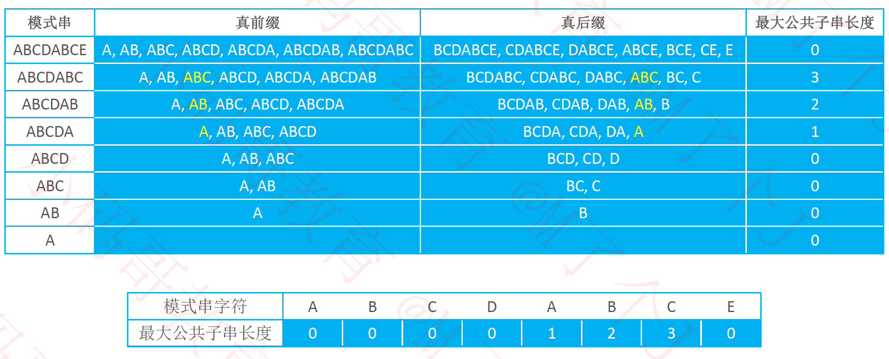
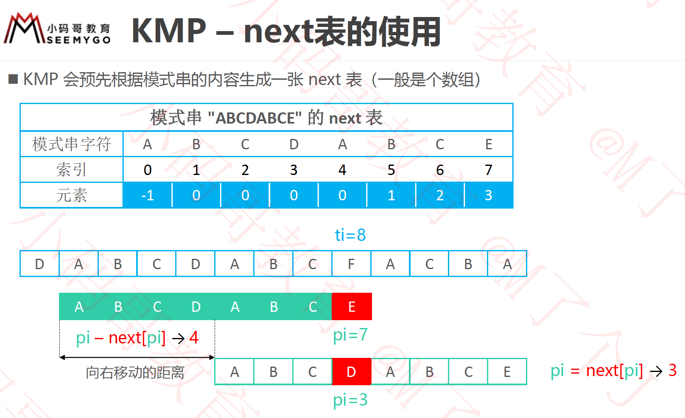
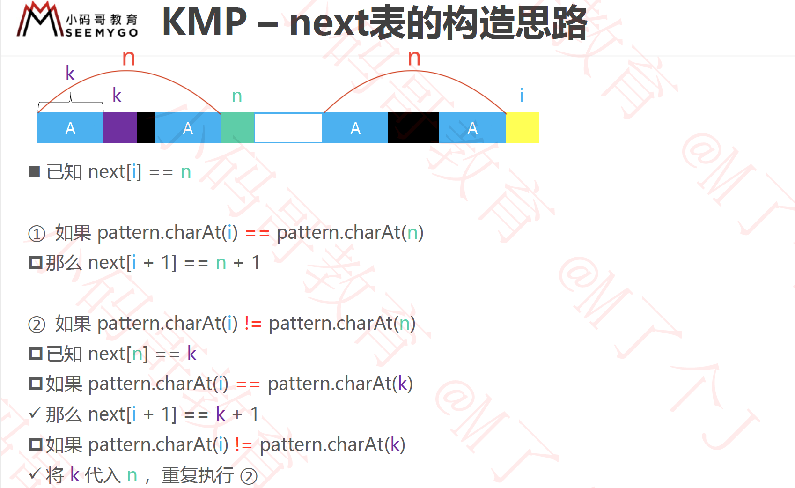

> 定义
>
>  0 <= ti <= strLen - 1
>
>  0 <= pi <= pLen - 1


###字符串匹配暴力方法

#####暴力一：

```c
//for循环
int force1(char *s, char *p){
    int strLen = (int)strlen(s);
    int pLen = (int)strlen(p);
    if (s == 0 || p == 0) {
        return -1;
    }
    int pi = 0;
    for(int ti = 0; ti < strLen - pLen; ti++) {
        pi = 0;
        while(pi < pLen && s[ti+pi] == p[pi]){
            pi++;
        }
        if(pi == pLen){
            return ti;
        }
    }
    return -1;

}

```


#####暴力二：

```c

//while
int force2(char *s, char *p){
    int strLen = (int)strlen(s);
    int pLen = (int)strlen(p);
    if (s == 0 || p == 0) {
        return -1;
    }
    int pi = 0;
    int ti = 0;
    while (pi < pLen && ti <=  strLen - pLen + pi) {
        if (s[ti] == p[pi]) {
            pi++;
            ti++;
        }else{
            pi = 0;
            ti =  ti - pi + 1;
        }
    }
    return pi == pLen ? ti - pi : -1;
}
```


暴力一使用for循环，通过for循环去修改原串的ti。

暴力二当失配的时候手动去调整ti和 pi去调整下一个ti的值。

kmp使用的是这种方式


### 前缀和后缀

 **前缀**: 指除了最后一个字符以外，一个字符串的全部头部组合

 **后缀**: 指除了第一个字符以外，一个字符串的全部尾部组合

对于模式串:`ABCDABCE` 的`next'`表



<center>图一</center>


### KMP 使用

####kmp中next表直观展示

需要特别说明下kmp中的next表，在使用的时候不是直接使用图一里面的`next'`表，而是要在图一的基础上往左移动一位， 第0个位置补-1。这么做是为了代码构造next表更方便。如下展示


<center>图二</center>


####失配过程


匹配失配的时候，pattern移动过程如下展示：



<center>图三</center>

这么做是为了代码构造next表更方便。

其中 *0 <= ti <= strLen - 1*, *0 <= pi <= pLen - 1*

 而在kmp中， 当在ti和pi处失配的时候, ti不变, 模式串往前挪动`pi - next[pi]`位， 并在`p`的`pi=next[pi]`处和`s`的`ti`处进行比较。

 之所以用最大公共子串的原因是, 使用最大公共子串时挪动模式串`pi - next[pi]`才是最小的，防止跳过头。

 `pi - next[pi]`表示：  **挪动位数= 匹配的位数- next表在pi的位置**


可直观地理解为， 当`s[ti]`和`p[pi]`失配的时候， `ti`不变，切换`pi=next[i]`, `ti`和切换后的`pi`继续进行匹配

```c
//@return: 匹配的初始位置， 没有匹配到返回-1
int kmp(char *s, char *p){
    //kmp 基于蛮力2的基础上 修改
    int strLen = (int)strlen(s);
    int pLen = (int)strlen(p);
    if (s == 0 || p == 0) {
        return -1;
    }
    int pi = 0;
    int ti = 0;
    int *nextTable = next(p);
    while (pi < pLen && ti <=  strLen - pLen + pi) {
      //pi == -1的时候表示失配的位置没有最大公共子串，
      //pi由0开始匹配，ti移到下一位
        if (pi < 0 || s[ti] == p[pi]) {
            ti++;
            pi++;
        }else{//失配
            pi = nextTable[pi];
        }
    }
    free(nextTable);
    return pi == pLen ?  ti - pi :  -1;
}
```


####构造next表

下图是经过求最大公共子串往右偏移一位的图



<center>图四</center>


经过偏移后新的next表，图中在next[i]处之前 即[0,i-1]的模式串，前缀和后缀最大公共子串的长度为3。

在未偏移之前，`next[i-1]=n` 这样的话构造上面的逻辑就不是很方便了


```c
/*
 该方法是基于新的模式表next进行构造的
 */
int *next(char *p){
    int pLen =  (int)strlen(p);
    int *nextTable  = malloc(sizeof(int) * pLen);
    memset(nextTable, 0, sizeof(int) * pLen);
    nextTable[0] = -1;
    int i = 0;
    int n = -1;//1. 已知next[i]=n, i=0
    while (i < pLen - 1) {
        if (n < 0 || p[i] == p[n]) {//2.当i位置和n位置相等时 (n < 0是第一个特殊条件)
            nextTable[i+1] = n+1;
            //i变成i+1了，对应的n变成了n+1。满足next[i]=n条件
            i++;
            n++;
        }else{//2.当i位置和n位置不相等时
            //i要和k位置比较， k位置就是next[n]
            n = nextTable[n];
        }
    }
    return nextTable;
}
```

