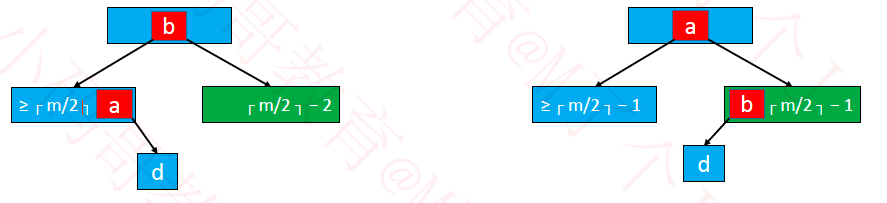
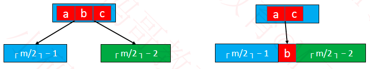

##  性质

B树是平衡M路树，拥有二叉搜索树的一些性质， 每个节点的所有子树高度都一致
假设节点【元素】个数是x
是根节点时: 1 <= x <= m -1
非根节点时：ceil(m/2)-1 <= x <= m - 1  //ceil(a)是对a向上取整函数 也可以用┌ a ┐表示
如果有子节点：
       - 根节点的【子节点个数】为[2,m]
       - 非根节点的【子节点个数】为[ceil(m/2),m]

⚠️注意： 上面的元素个数和字节点个数是不同的含义

## 添加元素
  ##### 上溢

新添加的元素必定是添加到叶子结点
添加元素后叶子元素超过m-1,即等于m时，这种现象称为**上溢**
上溢时： 假设上溢结点的元素中间元素位置为k，让改第k个元素与父节点合并, [0, k-1] [k+1, m-1]位置元素分裂为两个子节点
 如父节点也溢出，则重复上述操作,直至根节点

## 删除元素
####  删除的元素在非叶子节点：

​      1.找到前驱或者后继元素，覆盖掉删除的元素
​      2.再把前驱或者后继元素删除
​       因为非叶子节点的前驱和后继都在叶子结点， 所以真正删除的元素发生在叶子结点中

#### 删除的元素在叶子节点：

##### 下溢

 当元素个数小于ceil(m/2)-1时，即等于ceil(m/2)-2，这种现象称为下溢

- 如果下溢节点临近的兄弟，有至少 ceil(m/2)个时

   可以向其借一个元素，步骤如下：
   把父节点的元素b合并到本节点， 兄弟节点的元素a替换原父节点b的位置， 这个操作相当于***旋转***

​      

图一 旋转

- 如果下溢节点临近的兄弟，只有 ceil(m/2)-1个元素时
  将父节点的元素b 挪下来跟左右子节点进行， 合并后的节点元素个数等于ceil( m/2) + ceil( m/2 ) − 2，不超过m − 1。 这个操作可能会导致父节点下溢，依然按照上述方法解决，下溢现象可能会一直往上传播

​     

图二 合并

