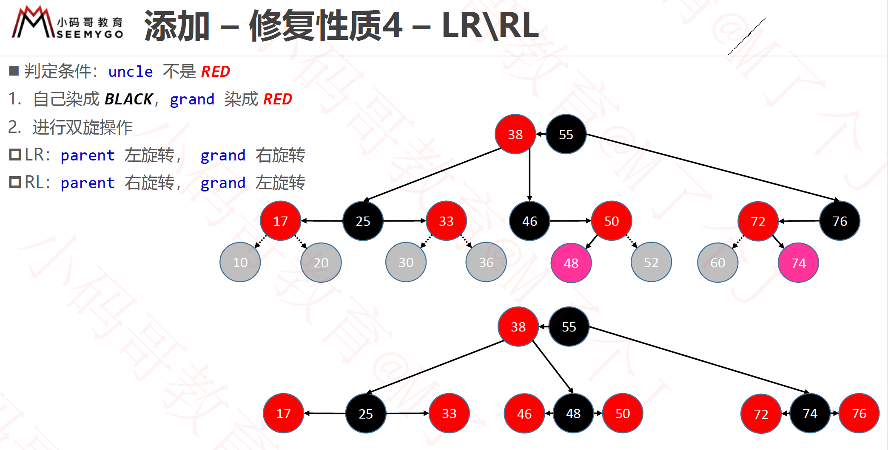

### 性质

红黑树的性质：
 1. 节点是 RED 或者 BLACK
 2. 根节点是 BLACK
 3. 叶子节点（外部节点，节点空）都是 BLACK
 4. RED节点的子节点都是 BLACK
    - RED节点的parent都是 BLACK
    - 从根节点到叶子节点的所路径上不能2个连续的RED节点
 5. 从任一节点到叶子节点的所有路径都包含相同数目BLACK节点


### 红黑树和4阶B树具有等价性质


红黑树在构建的时间可以当作B数来处理，black节点和它的红子节点融合成为一个B数的节点


### 添加


#### AVL树的旋转


##### 右单旋

右旋的前提是:

1. `height(T->left)-height(T->right) == 2 `
2. `newValue < T->left->val`

```c
/**
 前提：
 1. T左树的高度比右树多2
 2. T的左树有左树，T的左树的儿子中，左树高度比右树高
       O(T)              O(T_left)
      /  \              /   \
     O    O           O     O(T)
    /      \         /     /   \
   O        O       O     O     O
  /
 O(new)
 @param T 返回旋转后的根节点
 
 这里其实是右旋（T本来是left的父节点， 把它向右旋转变成left的右节点， 并改变方向， T的left继承原left的右节点）
 T, T—>left，T->left->left，  让T—>left节点成为新的父节点
 */
AvlPosition
SingleRotateToRight(AvlTree T){
    AvlPosition T_left = T->left;
    T->left = T_left->right;
    T_left->right = T;
    T->height = AVL_MAX(Height(T->left),Height(T->right)) + 1;
    T_left->height = AVL_MAX(Height(T->left),Height(T->right)) + 1;
    return T_left;
}

```


##### 左单旋

左旋的前提是:

1. `height(T->right)-height(T->left) == 2 `
2. `newValue > T->right->val`

```c
AvlPosition
SingleRotateToLeft(AvlTree T){
    AvlPosition T_right= T->right;
    T->right = T_right->left;
    T_right->left = T;
    T->height = AVL_MAX(Height(T->left),Height(T->right)) + 1;
    T_right->height = AVL_MAX(Height(T->left),Height(T->right)) + 1;
    return T_right;
}
```


#####  右双旋

右双旋的前提是:

1. `height(T->left)-height(T->right) == 2 `
2. `newValue > T->left->val`

```c
/**
 前提：
 1. T左树的高度比右树多2
 2. T的左树有右树，T的左树的儿子中，右树高度比左树高

         O(T)
        / \
       O   O
      / \
     O   O
         \
          O
 可以发现，如果只对T进行右旋的话， 还是没有平衡的，这时需要先对T->left进行左旋， 在对T进行右旋
 @param T是根节点
 @return 返回旋转后的根节点
 */
AvlPosition
DoubleRotateRight(AvlTree T){//
    /*先把T->left进行左旋转 */
   T->left = SingleRotateToLeft(T->left);
   return SingleRotateToRight(T);
}
```


##### 左双旋

左双旋的前提是:

1. `height(T->right)-height(T->right) == 2 `
2. `newValue > T->left->val`

```c
AvlPosition
DoubleRotateLeft(AvlTree T){
    /*先把T->right进行右旋转 */
    T->right = SingleRotateToRight(T->right);
    return SingleRotateToLeft(T);
}
```


#####  AVL Insert

```c
AvlTree
Insert(AvlTree T,AvlElementType X){
    if(T == NULL){
        T = malloc(sizeof(AvlTree));
        T->element = X;
        T->left = T->right = NULL;
        T->height = 0;
    }else if (X < T->element){
        T->left = Insert(T->left , X);
        if(Height(T->left) - Height(T->right) == 2){
            if(X < T->left->element){//X插在T的左树的左树 
               T = SingleRotateToRight(T);
            }else{//X 插在T的左树的右树
               T = DoubleRotateRight(T);
            }
        }
    }else if (X > T->element){
           T->right = Insert(T->right , X);
        if(Height(T->right) - Height(T->left) == 2){
            if(X > T->right->element){//X插在T的右树的右树
                T = SingleRotateToLeft(T);
            }else{//X 插在T的右树的左树
                T = DoubleRotateLeft(T);
            }
        }
    }
    T->height = AVL_MAX(Height(T->left),Height(T->right)) + 1;
    return T;
}
```


##### 新的根节点的根节点指引问题

注意被旋转的点内部不需要处理更上层的根节点问题， 比如右旋转的T不需要把T的父节点转移给`T->left`, 因为函数返回的是新的根节点， 外层函数会对新的根节点进行指定


#### 红黑树旋转


##### 右旋转和左旋转


```swift
    /// 对grand进行右旋转，并返回新的根节点
    /// 右旋： 有node 、parent、grand三个节点，把grand向右旋转作为parent的右子节点
    /// parent作为新的根节点，并重新设置新的根节点的父节点
    ///      O                                         O (old parent)
    ///     /                                          /       \
    ///    O (parent)   ====>             O          O
    ///   /                                          (node)
    ///  O (node)
    @discardableResult
    func singleRightRotation(_ grand: RBNode?) -> RBNode?{
        let parent = grand?.left
        let childOfParent = parent?.right
        //将新的根节点的右节点转过来用来平衡
        grand?.left = childOfParent
        //旋转原来根节点作为新的根节点的右节点
        parent?.right = grand
        //指定childOfParent，parent，grand它们的各自parent关系
        setupParentAfterRotation(childOfParent, parent, grand)
        return parent
    }
    
    /// 对grand进行左旋转，并返回新的根节点
    /// 左旋：  有node 、parent、grand三个节点，把grand向左旋转作为parent的左子节点
    /// parent作为新的根节点，并重新设置新的根节点的父节点
    /// O                                                  O (old parent)
    ///  \                                              /       \
    ///   O (parent)   ====>             O          O
    ///    \                                                 (node)
    ///     O (node)
    @discardableResult
    func singleLeftRotation(_ grand: RBNode?) -> RBNode? {
        let parent = grand?.right
        let childOfParent = parent?.left
        //将新的根节点的左节点转过来用来平衡
        grand?.right = childOfParent
        //旋转原来根节点作为新的根节点的左节点
        parent?.left = grand
        //指定childOfParent，parent，grand它们的各自parent关系
        setupParentAfterRotation(childOfParent, parent, grand)
        return parent
    }
    
```


##### 右双旋和左双旋

```swift
    /// 右双旋
    /// 先对parent进行左旋转，在对对grand进行右旋转，并返回新的根节点
    ///      O (grand)                              O (node)
    ///     /                                           /       \
    ///    O (parent)          ====>        O        O(grand)
    ///     \                                      (parent)
    ///      O (node)
    @discardableResult
    func doubleRightRotation(_ grand: RBNode?) -> RBNode?{
        singleLeftRotation(grand?.left)
        return singleRightRotation(grand)
    }
    
    /// 左双旋
    /// 先对parent进行右旋转，在对对grand进行左旋转，并返回新的根节点
    /// O (grand)                                    O (node)
    ///   \                                           /       \
    ///    O (parent)        ====>    O        O(parent)
    ///    /                                 (grand)
    ///   O (node)
    @discardableResult
    func doubleLeftRotation(_ grand: RBNode?) -> RBNode?{
        singleRightRotation(grand?.right)
        return singleLeftRotation(grand)
    }
```




##### 设置parent和child之间的联系

```c
    /// 旋转之后需要重新指定parent 和child之间的联系
    /// - Parameters:
    ///   - child: 旋转之前parent的子节点， 如果是右旋，child为parent的右节点， 反之是左节点
    ///   - parent: 旋转后新的根节点
    ///   - grand: 原来的祖父节点， 右旋后，成为parent的右节点， 左旋后，成为parent的左节点
    func setupParentAfterRotation(_ child: RBNode<E>?, _ parent: RBNode<E>?,  _ grand: RBNode<E>?){
        let topParent = grand?.parent
        parent?.parent = topParent
        // 还要判断parent是parent?.parent的左节点还是右节点
        if grand?.isLeft == true {
            topParent?.left = parent
        } else if grand?.isRight == true {
            topParent?.right = parent
        } else { //🔥 关键： grand本身是root节点
            root = parent
        }
        child?.parent = grand
        grand?.parent = parent
    }
```


#### AVL和红黑树旋转对比

因为红黑树中有parent这个属性， 旋转之后要对每个节点的parent进行重新设定， 而且root不是固定的，旋转之后也要对判断要不要调整.

AVL 没有parent字段，而且添加用的是递归，操作比较简洁


### 删除

和B树类似，最后真正被删除的元素都在叶子节点中 （和AVL数不一样，红黑树的叶子节点包括一个黑节点及其结合的两个红节点， 和B树类似，一个节点后多个元素）

删除主要按两大类分下去

类目一： 删除的节点是**红色** ： 直接删，不用做调整，因为红色节点依附黑色节点组成 一组元素，组成一个类似 B树的，节点，是不是节点是根据有没有黑色节点 

类目二： 删除的节点是黑色，这时就要分： 

（1） 黑色节至少有一个红色节点， 

（2）黑色节点两个孩子都是黑节点（黑色没有真正的黑节点， 因为他是叶子节点，这里说它有两个黑节点值得是两个**空节点**）

```swift
 public func remove(e: E) {
        guard var node = node(of: e) else {
            return
        }
        size -= 1
        if node.hasTwoChlden {//用前驱或者后继替换它即可
            //找到后继
           let successorNode = successor(node)! //hasTwoChlden 肯定有值
           // 用后继节点的值覆盖度为2的节点的值
           node.element = successorNode.element
           // 删除的点 变成后继节点
           node = successorNode
        }
        
        //node有0个或一个度
        let child = node.left != nil ? node.left : node.right
        let nodeIsRoot = node.parent == nil
        if let child = child { // 删除的node有一个节点, 让child和node.parent建立联系
            //这里就是类目二（1）的情况
            child.parent = node.parent //node就没有引用了
            if nodeIsRoot {
                root = child
            } else if node.isLeft {
                node.parent?.left = child
            } else {
                node.parent?.right = child
            }
            afterRemove(node,child)//这里是要处理child，因为node已经移除了
        } else if nodeIsRoot { //没有子节点 但是是根节点
            root = nil
            afterRemove(node, nil)
        } else { //没有子节点 也不是根节点。 断开父节点引用
          //这里就是类目一 或者类目二（1）的情况
            if node.isLeft {
                node.parent?.left = nil
            } else {
                node.parent?.right = nil
            }
            afterRemove(node, nil)
        }
    }
```


#### 删除的节点是红色

直接删除

图一删除元素17直接删除即可

#### 删除的节点是黑色


<center>图一</center>


##### 有一个红色的节点： 

该红色的节点就是代替被 删除的黑色节点，直接染黑即可 （在`afterRemove`函数染黑色， 指针的问题在`remove`函数操作了）

```swift
func afterRemove(_ node: RBNode<E>, _ child: RBNode<E>?) {
        // 删除的节点是红色 不需要调整；
        if isRed(of: node) { return }
        // 替换它的孩子是红色，child染黑即可， 两者合并为
        if isRed(of: child) {
            setBlack(child)
            return
        }
}
```


##### 没有其他节点（只有两个黑色空节点）： 


###### 情况一：

兄弟节点是黑色，且只有空节点， 比如删除88， 兄弟节点76没有红色

- 如果父节点是红色，父节点下移。父节点染黑， 兄弟染红

- 如果父节点是黑色，父节点下移有空腔，父节点染黑，对父节点执行下滤操作， 兄弟染红

  


<center>图二</center>

 ```swift
if isBlack(of: sibling?.left) && isBlack(of: sibling?.right) { //兄弟节点都是黑的，null也是黑节点， 所以这里表示sibling是没有孩子）
                //将 sibling染成红色、parent染成 BLACK 即可修复红黑树性质
                //父亲是红色的话要染黑，并有下滤的操作
                let parentIsBlack = isBlack(of: parent)
                setBlack(parent)
                setRed(sibling)
                if parentIsBlack {//
                    afterRemove(parent, nil)
                }
            }
 ```


###### 情况二

**sibling为BLACK**


<center>图三</center>

如要删除图三中的88需要， 对父节点右双旋转，父节点染成黑色， 旋转之后的中心节点继承parent 的颜色

旋转之后的左右节点染为***BLACK\***

```swift
//兄弟节点至少有1个红节点，
                if isBlack(of: sibling?.left)  {
                     singleLeftRotation(sibling)
                     sibling = parent.left;
                }
                setColor(sibling, with: color(of: parent))
                setBlack(sibling?.left)
                setBlack(parent)
                singleRightRotation(parent)
```


**sibling为red**


<center>图四</center>

sibling 染成***BLACK***，parent 染成***RED***，进行旋转，变成了图三的情况，  按照图三的情况走即可

```swift
 //兄弟是红节点（它和父节点在一层）, 这个比较特殊， 先转成黑色和黑色情况一起处理 图四
if isRed(of: sibling) {
    setBlack(sibling)
    setRed(parent)
    singleRightRotation(parent)
    sibling = parent.left //兄弟节点改变了
  }
```


### 红黑树的平衡

为何那5条性质，就能保证红黑树是平衡的？

​      那5条性质，可以保证红黑树等价于4阶B树


相比AVL树，红黑树的平衡标准比较宽松：没有一条路径会大于其他路径的2倍

是一种弱平衡、黑高度平衡

红黑树的最大高度是2∗log2(n+1)，依然是O(logn) 


##### 平局时间复杂度

搜索：O(logn)

添加：O(logn)，O(1) 次的旋转操作

删除：O(logn)，O(1) 


### AVL树 VS 红黑树


##### AVL树

平衡标准比较严格：每个左右子树的高度差不超过1

最大高度是1.44∗log2n+2−1.328（100W个节点，AVL树最大树高28）

搜索、添加、删除都是O(logn) 复杂度，其中添加仅需O(1) 次旋转调整、**删除最多需要O(logn) 次旋转调整**！

##### 红黑树

平衡标准比较宽松：没有一条路径会大于其他路径的2倍

最大高度是2∗log2(n+1)（100W个节点，红黑树最大树高40）

搜索、添加、删除都是O(logn) 复杂度，其中添加、删除都仅需O(1) 次旋转调整


##### 选择

搜索的次数远远大于插入和删除，选择AVL树；搜索、插入、删除次数几乎差不多，选择红黑树

相对于AVL树来说，红黑树牺牲了部分平衡性以换取插入/删除操作时少量的旋转操作，整体来说性能要优于AVL树

红黑树的平均统计性能优于AVL树，实际应用中更多选择使用红黑树