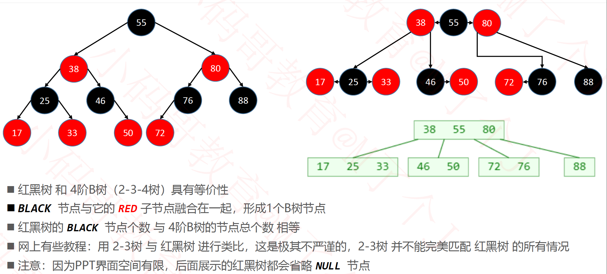

### 性质

红黑树的性质：
 1. 节点是 RED 或者 BLACK
 2. 根节点是 BLACK
 3. 叶子节点（外部节点，节点空）都是 BLACK
 4. RED节点的子节点都是 BLACK
    - RED节点的parent都是 BLACK
    - 从根节点到叶子节点的所路径上不能2个连续的RED节点
 5. 从任一节点到叶子节点的所有路径都包含相同数目BLACK节点


### 红黑树和4阶B树具有等价性质





红黑树在构建的时间可以当作B数来处理，black节点和它的红子节点融合成为一个B数的节点


### AVL树的旋转


#### 右单旋

右旋的前提是:

1. `height(T->left)-height(T->right) == 2 `
2. `newValue < T->left->val`

```c
/**
 前提：
 1. T左树的高度比右树多2
 2. T的左树有左树，T的左树的儿子中，左树高度比右树高
       O(T)              O(T_left)
      /  \              /   \
     O    O           O     O(T)
    /      \         /     /   \
   O        O       O     O     O
  /
 O(new)
 @param T 返回旋转后的根节点
 
 这里其实是右旋（T本来是left的父节点， 把它向右旋转变成left的右节点， 并改变方向， T的left继承原left的右节点）
 T, T—>left，T->left->left，  让T—>left节点成为新的父节点
 */
AvlPosition
SingleRotateToRight(AvlTree T){
    AvlPosition T_left = T->left;
    T->left = T_left->right;
    T_left->right = T;
    T->height = AVL_MAX(Height(T->left),Height(T->right)) + 1;
    T_left->height = AVL_MAX(Height(T->left),Height(T->right)) + 1;
    return T_left;
}

```


#### 左单旋

左旋的前提是:

1. `height(T->right)-height(T->left) == 2 `
2. `newValue > T->right->val`

```c
AvlPosition
SingleRotateToLeft(AvlTree T){
    AvlPosition T_right= T->right;
    T->right = T_right->left;
    T_right->left = T;
    T->height = AVL_MAX(Height(T->left),Height(T->right)) + 1;
    T_right->height = AVL_MAX(Height(T->left),Height(T->right)) + 1;
    return T_right;
}
```


#### 右双旋

右双旋的前提是:

1. `height(T->left)-height(T->right) == 2 `
2. `newValue > T->left->val`

```c
/**
 前提：
 1. T左树的高度比右树多2
 2. T的左树有右树，T的左树的儿子中，右树高度比左树高

         O(T)
        / \
       O   O
      / \
     O   O
         \
          O
 可以发现，如果只对T进行右旋的话， 还是没有平衡的，这时需要先对T->left进行左旋， 在对T进行右旋
 @param T是根节点
 @return 返回旋转后的根节点
 */
AvlPosition
DoubleRotateRight(AvlTree T){//
    /*先把T->left进行左旋转 */
   T->left = SingleRotateToLeft(T->left);
   return SingleRotateToRight(T);
}
```


#### 左双旋

左双旋的前提是:

1. `height(T->right)-height(T->right) == 2 `
2. `newValue > T->left->val`

```c
AvlPosition
DoubleRotateLeft(AvlTree T){
    /*先把T->right进行右旋转 */
    T->right = SingleRotateToRight(T->right);
    return SingleRotateToLeft(T);
}
```


#### Insert

```c
AvlTree
Insert(AvlTree T,AvlElementType X){
    if(T == NULL){
        T = malloc(sizeof(AvlTree));
        T->element = X;
        T->left = T->right = NULL;
        T->height = 0;
    }else if (X < T->element){
        T->left = Insert(T->left , X);
        if(Height(T->left) - Height(T->right) == 2){
            if(X < T->left->element){//X插在T的左树的左树 
               T = SingleRotateToRight(T);
            }else{//X 插在T的左树的右树
               T = DoubleRotateRight(T);
            }
        }
    }else if (X > T->element){
           T->right = Insert(T->right , X);
        if(Height(T->right) - Height(T->left) == 2){
            if(X > T->right->element){//X插在T的右树的右树
                T = SingleRotateToLeft(T);
            }else{//X 插在T的右树的左树
                T = DoubleRotateLeft(T);
            }
        }
    }
    T->height = AVL_MAX(Height(T->left),Height(T->right)) + 1;
    return T;
}
```


#### 新的根节点的根节点指引问题

注意被旋转的点内部不需要处理更上层的根节点问题， 比如右旋转的T不需要把T的父节点转移给`T->left`, 因为函数返回的是新的根节点， 外层函数会对新的根节点进行指定

